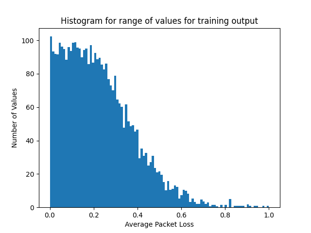
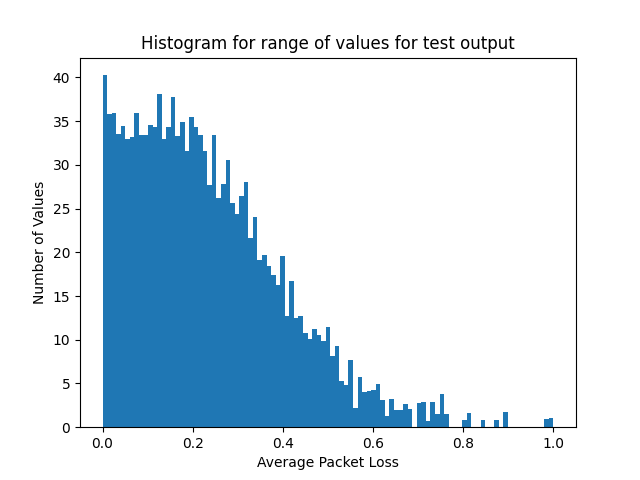

# Spiking Neural Network for Networking Topology Data

## Background
Each sample simulates a network scenario which comprises of three different aspects: 

* Network topology
* Routing configuration
* Source-destination traffic matrix

The scenarios are labeled with network performance metrics defined by the simulator, including per-source-destination performance measurements (mean per-packet delay, jitter, and loss), and port statistics (e.g., queue utilization, average packet loss). **The focus is on the prediction of the mean per-packet delay on each source-destination path.**

The training dataset contains networks of 25-50 nodes. The validation dataset contains samples of networks that are larger (51-300 nodes). The test dataset has network data of similar size to the validation dataset.

The training dataset contains samples simulated in topologies of 25, 30, 35, 40, 45, and 50 nodes, including two different network topologies for each topology size. 

The validation dataset contains samples on larger network topologies. Particularly, they contain two different topologies for each of the following network sizes: 50, 55, 60, 65, 70, 75, 80, 85, 90, 95, 100, 110, 120, 130, 140, 150, 160, 170, 180, 190, 200, 220, 240, 260, 280, and 300. 

## Dataset Description

The dataset can be downloaded from https://bnn.upc.edu/challenge/gnnet2021/dataset/. 

### `routings` Directory
Routing configuration files are stored here. These files include a line for each source-destination path, defined as a list of the nodes that form the path. 

### `graphs` Directory
Each topology file describes the nodes and links of the topology in Graph Modeling Language (GML). This file can be processed using the following: 

`G = networkx.read_gml(topology_file, destringizer = int)`

### `input_files.txt`
Each line of this file contains the simulation number, the topology file, and the routing file used for the simulation.

### `traffic.txt`
Contains the traffic parameters used by the simulator to generate the traffic for each iteration. At the beginning of each line there is the `maxAvgLambda` selected for this iteration. This parameter is separated from the rest of the information with the `|` character. The rest of the line corresponds to the parameters used to generate the traffic for each path. Paths information are separated with a `;`, and the parameters used for those paths are separated with commas `,`. The parameters of each path depend on the time a packet size distribution used and is structured as follows: 

`<time_distribution>, <equivalent_lambda>, <time_dist_param_1>,..., <time_dist_param_n>, <size_distribution>, <avg_pkt_size>, <size_dist_param_1>,..., <size_dist_param_n>, <ToS>`

### `simulationResults.txt`
Contains measurements obtained by our network simulator for every sample. Each line in the file corresponds to a simulation using the toplogy and routing specified in the `input_files.txt`, and the input traffic matrices specified in `traffic.txt`. 

At the beginning of each line, and separated by `|`, there are global network statistics separated by `,`. These global parameters are:

1. `global_packets`: Number of packets transmitted in the network per time unit (packets/time unit).

2. `global_losses`: Packets lost in the network per time unit (packets/time unit).

3. `global_delay`: Average per-packet delay over all the packets transmitted in the network (time units). 

After the `|` and separated by `;`, we have the list of all paths. Finally, the metrics of the related to a path are separated by `,`. Likewise, the different measurements (e.g., delay, jitter) for each path are separated by `,`. To obtain a pointer to the metrics of the specific path from `node_src` to `node_dst`, one can split the .csv format considering the `;` as the separator:

`list_metrics[src_node * n + dst_node] = path_metrics` (from source to destination)

Where `list_metrics` is the array of strings obtained from splitting the line after the `|` character using `;`. Nodes are enumerated from [0, n - 1], for n nodes. This pointer will return a list of measurements for a particular src-dst path. This list of measurements are separated by a `,` and provide the following measurements: 

* Bandwidth (kbits/time unit) transmitted in each source-destination pair in the network.
* Number of packets transmitted in each src-dst pair per time unit.
* Number of packets dropped in each each src-dst pair per time unit.
* Average per-packet delay over the packets transmitted in each src-dst pair (in time units).
* Average neperian logarithm of per-packet delay over the packets transmitted in each src-dst pair (in time units).
* Percentile 10 of the per-packet delay over the packets transmitted in each src-dst pair (in time units).
* Percentile 20 of the per-packet delay over the packets transmitted in each src-dst pair (in time units).
* Percentile 50 of the per-packet delay over the packets transmitted in each src-dst pair (in time units).
* Percentile 80 of the per-packet delay over the packets transmitted in each src-dst pair (in time units).
* Percentile 90 of the per-packet delay over the packets transmitted in each src-dst pair (in time units).
* Variance of the per-packet delay over the packets transmitted in each src-dst pair.

### `stability.txt`
Contains some extra information used to evaluate the status of the dataset. The more relevant parameter from this file is the simulation time required to reach the stability condition which, for each simulation, is the first element of the line.

### `linkUsage.txt`
For each src-dst pair, if there is a link between them, it contains the outgoing port statistics separated by `,` or `-1` otherwise. Each src-dst port information is separated from the rest by `;`. The list of parameters for each src-dst outgoing port is:

1. Average utilization of the outgoing port (in the range [0,1]). 
2. Average packet loss rate in the outgoing port (in the range [0,1]). 
3. Average packet length of the packets transmitted through the outgoing port.
4. Average utilization of the first queue of the outgoing port (in the range [0,1]).
5. Average packet loss rate in the first queue of the outgoing port (in the range [0,1]).
6. Average port occupancy (service and waiting queue) of the first queue of the outgoing port.
7. Maximum queue occupancy of the first queue of the outgoing port.
8. Average packet length of the packets transmitted through the first queue of the outgoing port.

## Preprocessing

The script `preprocessing.py` is used on unzipped data files. A `NetworkInput` object is created with various data structures. Currently, getting information about the routes present in the dataset is still a work in progress. However, we are able to extract information about the traffic measurements, simulation results, and the link usage. This information is organized into a dataframe, and then written as a .csv file. In particular, the following methods are used to generate each of these data structures:

### Traffic measurements

The traffic measurements data structure is formatted as a triply nested dictionary in the following format:

````
{Max Average Lambda: {Time Distribution: <time distribution name>,
                    Time Distribution Parameters: {...},
                    Size Distribution: <size distribution name>,
                    Size Distribution Parameters: {...}
                    }
}
````

* `get_traffic_metrics`: returns a dictionary with maximum average lambda value as the key, and the rest of the metrics as a value.

* `get_time_size_distribution_parameters`: calls to functions that extract and organize time (`create_traffic_time_distribution`) and size (`create_traffic_size_distribution`) distribution information about the traffic metrics.

* `create_traffic_time_distribution`: fill out the dictionary with time distribution metrics. 

* `create_traffic_size_distribution`: fill out the dictionary with size distribution metrics.

* `get_max_avg_lambda`: process the string with the maximum average lambda value and retrieve that value for the corresponding dictionary. 

### Simulation Results

The simulation results data structure is formatted as a list of lists of dictionaries.

* `get_simulation_metrics`: extract information about global packets, global losses, global delays, and simulation metric results. 

* `create_simulation_list`: extract the individual simulation results, populate the dictionary, and append them to the array.

* `modify_tokens`: modifies the measurement tokens list so that are no '|' or ';' present, but all tokens are separated and present. 

### Link Usage

The link usage are organized as a list structure.

* `get_link_usage_metrics`: given a link usage file, extract information about various metrics present. If a link does not exist, populate the list of metrics with all -1. 

## Data Processing for Spiking Neural Network

Further data processing is applied to get the data ready to run through a spiking neural network. For this segment, Amazon Web Services was particularly useful. All the preprocessed data so far was uploaded to an S3 bucket. `snn_data_processing.py` provides the APIs used alongside a description of each function. These functions were run on SageMaker. While the functions and the main driver code are provided here, it would be best to run this in SageMaker on the account that has the corresponding S3 bucket. 

The main target of focus is the average packet loss in this experiment. Each average packet loss value was placed in a bin. The average packet loss values ranges between 0 and 1, inclusive. One hundred bins were created. The following histograms display the distribution of the training and test target values. 




## Running the Spiking Neural Network

